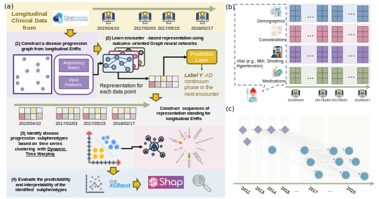
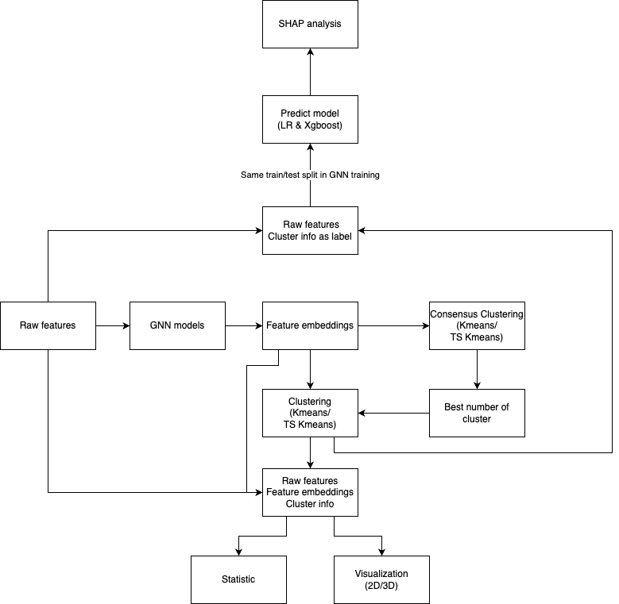

# GraphModeling
GraphModeling is a comprehensive graph modeling tool that includes multiple Graph Neural Network (GNN) models for tasks such as classification, feature embedding, clustering, and future analysis.

## Overview of Paper


## Overview of this tool 


## Create conda env name as graphmodel and activate it 
```console
conda env create -n graphmodel -f graph_model_env.yml
conda activate graphmodel
```
## Running step
After you install related envirnoment

### 1. Produce sampling index for future consistent
Navigate to Utils/Sampling_index/Sampling_index.ipynb. Here, you can generate training and validation indices based on your data and save them for future use.
(Make sure to use the same random seed when tuning your model.)

### 2. Tune GNN model
Change the directory in the JSON file and adjust settings as needed.
Then, run the following command:
```console
python 1.Model_tuning.py -s Settings/Tuning/tuning.json   
```
For tuning on a high-performance platform:
Navigate to Slurm Manager(Hipergator) folder.
Adjust the directory and settings in both Settings/Tuning/tuning.json and Slurm Manager(Hipergator)/slurm_model_tuning.sh as needed.
Then, execute:
```console
sh 0.job submitter.sh
```
### 3. Consensus Clustering
This step helps find the best K in clustering with feature embeddings from the fine-tuned model.
(For large datasets, use only 10% of the training set for Consensus Clustering. Load the index prepared earlier. This can be ignored for smaller datasets.)
Navigate to the Consensus_Clustering folder.
Run on your environment or via Slurm on a high-performance platform:
```console
python Consensus_Clustering.py  
```
```console
sbatch slurm_Consensus_Clustering.sh
```
### 4. Clustering
After determining the best K, run clustering based on this value. Use the same data from Consensus Clustering to fit the Clustering model and predict clusters for the entire dataset.
```console
python 2.Clustering.py -s Settings/Clustering/clustering.json
```

### 5. Predict_modeling
After obtaining cluster information, we analyze raw feature information to predict clusters using basic machine learning methods.
#### 5.1 Prepare data
Load the data and calculate the correlation matrix for each model for future use. Run on your environment or via Slurm:
```console
python preprocess.py
```
```console
sbatch slurm_preprocess.sh
```
#### 5.2 Predict_modeling and SHAP analysis
We provide a notebook for predictive modeling and SHAP analysis in Predict_modeling/Modelling and shap-whole dataset - Magnet(example).ipynb.
This includes logistic regression and XGBoost models, feature selection based on the correlation matrix for comparison, and SHAP value analysis.

### 6. Visualization and Statistic
After obtaining cluster information, we perform visualization and statistical analysis on the validation dataset, as indexed previously.
We apply UMAP decomposition to reduce feature embeddings to lower dimensions and visualize them in 2D and 3D plots.
Statistical analyses are performed on each raw feature to understand the meanings of different clusters.
Change the directory in the JSON file and adjust settings as needed.
Then, execute:
```console
python 3.Visualization.py -s Settings/Visualization/Visualization.json
python 4.Statistics.py -s Settings/Statistic/statistic.json
```
For tuning on a high-performance platform:
Navigate to Slurm Manager(Hipergator) folder.
Adjust the directory and settings in both Settings/Visualization/Visualization.json and Settings/Statistic/statistic.json, as well as in Slurm Manager(Hipergator)/slurm_Visualization.sh and Slurm Manager(Hipergator)/slurm_Statistics.sh as needed.
Then, run:
```console
sh 0.job submitter.sh
```

